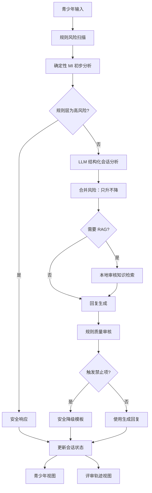

# 系统架构

## 1. 目标

Re:Play 的第一阶段目标是形成一个可运行、可观察、可测试的单页对话闭环，而不是堆叠大量功能。每轮会话需要回答四个问题：

1. 用户当前最在意什么；
2. 是否存在需要优先处理的安全风险；
3. 本轮应该采用哪一种 MI 策略；
4. 回复依据是什么，系统是否发生降级。

## 2. 处理链路



## 3. 模块职责

### `config.py`

统一读取模型配置，并兼容项目已有的三套环境变量名称。应用内部只使用 `llm_api_key`、`llm_base_url` 和 `llm_model`。

### `schemas.py`

定义 API 与内部状态的强类型边界，包括：

- 会话阶段；
- 风险等级；
- MI 策略；
- 心理需要；
- 改变语言与维持语言；
- 行动计划；
- 评审轨迹。

### `safety.py`

采用可审计的关键词和短语规则完成第一层风险扫描。语义模型可以提高风险等级，但不能降低规则层已经发现的等级。

### `mi.py`

提供确定性的会话状态分析。即使模型服务不可用，系统仍能识别基础关注点、心理需要、改变语言、阶段和建议策略。

### `rag.py`

第一阶段采用无外部依赖的透明词法检索。接口保持稳定，后续可以在不改变业务编排层的情况下替换为 BM25、向量检索和重排器。

### `llm.py`

封装 OpenAI 兼容接口，分别完成：

1. 结构化会话分析；
2. 基于 MI 策略和知识依据生成回复。

任何网络异常、供应商差异或 JSON 解析失败都会返回 `None`，由业务层安全降级。

### `quality.py`

检查诊断和标签化、强迫语言、依赖诱导、虚假救援承诺、长度和提问数量等问题。严重禁止项会触发回复替换。

### `service.py`

业务编排中心，负责：

- 会话状态；
- 风险合并；
- RAG 调用；
- 回复生成；
- 质量审查；
- 行动卡形成；
- 评审轨迹返回。

## 4. 会话状态机

```text
ENGAGE  建立关系，理解游戏价值
FOCUS   与用户共同选择一个优先问题
EVOKE   引出用户自己的改变理由
PLAN    形成足够小的行动实验
REVIEW  复盘条件、失败原因和调整方向
SAFETY  暂停普通流程，优先确认安全与现实支持
```

状态允许回退。例如用户在计划阶段表达“我根本做不到”，系统应回到 `EVOKE`，而不是继续追加任务。

## 5. 当前存储策略

第一阶段使用内存会话存储，原因是：

- 比赛原型不正式上线；
- 不应在早期保存真实未成年人敏感数据；
- 便于测试状态迁移；
- 一键重置后不残留数据。

进入第二阶段后可接入 SQLite，但仍应设置短期保留、匿名会话和一键清空。

## 6. 降级策略

| 故障 | 处理方式 |
|---|---|
| 未配置 API Key | 使用确定性 MI 分析与安全模板 |
| 模型请求超时 | 重试一次后降级 |
| 模型返回无效 JSON | 丢弃本轮模型分析，使用规则结果 |
| RAG 无命中 | 只进行 MI 对话，不编造专业知识 |
| 生成回复触发禁止项 | 替换为审核过的安全模板 |
| 前端请求失败 | 保留本地用户消息并提示重试 |

## 7. 后续演进

第二阶段将逐步加入：

- SQLite 会话与行动计划存储；
- BM25 与本地中文向量检索；
- 面向场景集的自动评测器；
- LLM 质量审查与规则审核双层机制；
- 流式输出；
- 结构化日志与延迟指标。
