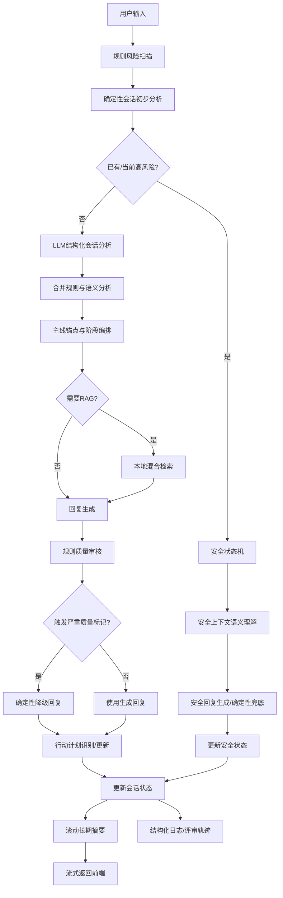

# 系统架构

## 1. 架构定位

Noname助手的最终比赛版本采用“确定性安全底座 + LLM结构化分析 + MI状态化会话 + 按需RAG + 长期记忆 + 微行动实验”的多层 Agent 架构。

系统不把大语言模型本身等同于 Agent。LLM 主要负责语义理解与语言生成，真正的 Agent 能力来自外部的会话状态、阶段迁移、知识检索、行动状态、安全状态机和质量审核。

每一轮会话重点回答：

1. 用户当前在说什么、最初为什么开始这段对话；
2. 是否存在需要优先处理的安全风险；
3. 当前处于哪个 MI 阶段；
4. 本轮应采用什么策略；
5. 是否需要知识检索；
6. 是否已经形成用户自主的行动意图；
7. 回复是否通过安全与质量审核；
8. 哪些状态需要带入下一轮。

## 2. 总体处理链路


```mermaid
flowchart TD
    A[用户输入] --> B[规则风险扫描]
    B --> C[确定性会话初步分析]
    C --> D{已有/当前高风险?}
    D -- 是 --> E[安全状态机]
    E --> F[安全上下文语义理解]
    F --> G[安全回复生成/确定性兜底]

    D -- 否 --> H[LLM结构化会话分析]
    H --> I[合并规则与语义分析]
    I --> J[主线锚点与阶段编排]
    J --> K{需要RAG?}
    K -- 是 --> L[本地混合检索]
    K -- 否 --> M[回复生成]
    L --> M

    M --> N[规则质量审核]
    N --> O{触发严重质量标记?}
    O -- 是 --> P[确定性降级回复]
    O -- 否 --> Q[使用生成回复]

    P --> R[行动计划识别/更新]
    Q --> R
    G --> S[更新安全状态]
    R --> T[更新会话状态]
    S --> T
    T --> U[滚动长期摘要]
    U --> V[流式返回前端]
    T --> W[结构化日志/评审轨迹]
```

## 3. 会话状态机

```text
ENGAGE  建立关系，理解游戏价值
FOCUS   与用户共同明确一个优先问题
EVOKE   引出用户自己的改变理由与矛盾
PLAN    在用户愿意尝试后形成微行动实验
REVIEW  根据后续反馈复盘并调整
SAFETY  暂停普通流程，优先确认安全与现实支持
```

阶段不是严格单向流程。系统允许根据用户表达回到更早阶段，例如用户在计划阶段表现出低意愿时，不应继续强推任务。

### 3.1 MI策略

系统为每轮分析输出最多两个主要策略，例如：

- `SIMPLE_REFLECTION`
- `COMPLEX_REFLECTION`
- `SUMMARY`
- `OPEN_QUESTION`
- `AUTONOMY_SUPPORT`
- `ELICIT_CHANGE_TALK`
- `ASK_PERMISSION`
- `ACTION_PLANNING`
- `REVIEW_AND_ADJUST`

这些策略参与回复生成，而不是只作为展示标签。

## 4. 主线锚点与当前焦点

多轮会话中，系统分别维护：

- `focus_topic`：当前这一轮正在讨论的主题；
- `primary_focus_topic`：用户更早主动提出的主线关注；
- `primary_focus_excerpt`：主线原始表达的短摘录。

例如：

```text
用户：最近总是玩到很晚
→ primary_focus = sleep

后续：朋友一起玩 / 团队合作 / 一起赢
→ 当前可以探索 social / belonging / achievement
→ primary_focus 仍保持 sleep
```

当系统检测到连续多轮停留在同一支线、没有回到原始关注点时，会触发 bridge-back：先总结已经理解到的游戏价值，再自然返回主线，而不是机械继续追问“还有什么意义”。

## 5. 长期会话记忆

长期记忆采用三层结构：

### 5.1 近期原始消息

正常分析与回复读取最近的原始多轮消息，以保留细节和短回答上下文。

### 5.2 滚动摘要

当消息规模达到阈值后，将较早对话压缩为 `conversation_summary`，保留：

- 用户明确表达的关注问题；
- 游戏带来的价值；
- 现实影响；
- 用户自己的改变理由；
- 已尝试过的行动和结果；
- 尚未解决的困难。

当前实现达到压缩阈值后保留最近 16 条消息，并将较早内容合并进摘要。

### 5.3 独立结构化状态

以下关键状态不只依赖自然语言历史：

- 主线锚点；
- 当前会话分析；
- 行动计划；
- 安全状态。

因此长对话能力不是单纯依赖扩大模型上下文窗口。

## 6. RAG知识检索

当前最终版本采用本地透明混合检索：

```text
BM25词法相关性
+
中文字符2/3/4-gram相似度
+
关键词加权
+
类别加权
```

默认最多返回 4 条命中。每条命中保留：

- 条目 ID；
- 标题；
- 类别；
- 摘要；
- 建议行动；
- BM25 分数；
- n-gram 相似度；
- 匹配词；
- 来源名称与来源链接。

RAG 为“按需调用”，不是每轮强制调用。高风险状态下只允许检索安全类知识。

该方案的优势是依赖少、结果透明、可审计；局限是它不是神经向量检索，对复杂语义泛化能力有限。

## 7. 微行动规划模块

当前规划模块的准确定位是：

> 基于 MI 阶段、用户行动意图、当前关注主题和知识依据的结构化微行动规划模块。

它不是通用自主 Planner。

### 7.1 触发原则

只有当用户明确表达愿意尝试，或直接提出一个可执行行为时，系统才创建行动实验。单纯询问“有没有什么办法”不会自动创建计划。

### 7.2 当前支持的典型行为

- 减少一定游戏时长；
- 设置时间限制、结束时间或下线边界；
- 提前结束；
- 设置闹钟或提醒；
- 每局结束后暂停几分钟，再决定是否继续；
- 与学习启动、家庭沟通、情绪观察等相关的微行动。

### 7.3 ActionPlan结构

```text
title
behavior
duration
reason
confidence
obstacle
coping_plan
attempts
successes
status
last_review
```

其中行为优先来自用户自己的表达；原因、障碍和应对方式在用户没有完整说出时，当前原型可能根据会话主题辅助补全，因此这些字段不能一律解释为“用户明确陈述”。

### 7.4 规划模块边界

当前实现适用于单个领域微行动的形成与后续状态更新，不支持复杂子任务依赖、多个并行计划、长期日程优化或通用任务分解。

## 8. 安全架构

安全模块采用多层控制，而不是只依赖一个安全 Prompt。

### 第一层：规则风险扫描

确定性规则识别明确自伤、自杀、立即危险、无法保证安全、暴力/虐待等高风险表达，以及严重缺觉、拒学等关注级风险。

### 第二层：语义风险理解

LLM 可根据上下文补充语义风险，但不能降低规则层已经识别出的风险等级。

### 第三层：持久 SafetyConversationState

安全状态记录：

- 是否存在自伤想法；
- 是否有立即计划；
- 是否正在受伤；
- 当前是否安全；
- 是否独处；
- 是否有人陪伴；
- 是否联系现实支持；
- 是否远离危险物品；
- 是否拒绝求助。

高风险状态会跨轮持续，不因为下一句话没有再次出现危险关键词就自动退出。

### 第四层：程序化退出条件

LLM 不能自行宣布“风险已经解除”。退出 SAFETY 由程序基于明确安全信息判断。

## 9. LLM层

LLM 通过 OpenAI 兼容接口完成：

1. 正常会话结构化分析；
2. 正常回复生成；
3. 安全上下文结构化理解；
4. 安全回复生成；
5. 长期会话摘要。

系统优先使用 JSON mode；如果供应商不支持 JSON mode 或 temperature 参数，会自动采用兼容模式。模型请求失败、结构化解析失败时，业务层使用确定性分析和 fallback，而不是让请求直接失效。

## 10. 质量审核

生成回复仍要通过规则质量检查，包括：

- 诊断和标签化；
- 强迫性语言；
- AI依赖诱导；
- 虚假现实救援承诺；
- 高风险下偏离安全主题；
- 欺骗或规避；
- 内部状态泄露；
- 回复过长；
- 单轮问题过多。

严重标记触发时，生成回复会被替换为确定性 fallback。

## 11. 前后端与输出

### 后端

- FastAPI
- Pydantic
- OpenAI兼容接口
- 本地知识库
- 会话状态存储
- Pytest

### 前端

- React
- TypeScript
- Vite
- Lucide React

前端调用 `/api/chat/stream`。当前流式方案是应用层安全流式：后端先完成完整生成、风险与质量审核，再以 NDJSON 的 `start → meta → delta → done` 顺序逐段返回，因此不会把未经审核的原始模型 token 直接推送给用户。

## 12. 可观察性

后端每轮输出 `TURN_STATE`，核心字段包括：

```text
stage
risk
focus
anchor
strategies
needs
importance / confidence
next_goal
rag / hits
fallback
plan
safety
summary_chars
quality
analysis_mode
completion_mode
processing_ms
```

安全状态还会额外输出 `SAFETY_STATE`，长期摘要发生时输出 `LONG_MEMORY`。

这些日志不直接记录用户原文，主要用于开发调试和比赛演示。

## 13. 当前系统边界

最终比赛版本已经实现：

- MI状态化会话；
- 主线锚点；
- 长期滚动摘要；
- BM25 + 中文字符 n-gram 混合RAG；
- 用户意图驱动的结构化微行动实验；
- 多轮持续安全状态；
- 质量审核与fallback；
- 应用层流式输出；
- 结构化日志；
- 自动化测试与场景评测框架。

当前没有宣称实现：

- 医学或心理诊断；
- 临床治疗效果；
- 通用自主任务规划；
- 正式未成年人长期数据服务；
- 已完成的大规模真实用户研究。
